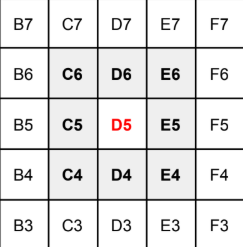
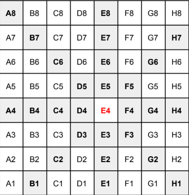

Java version: 17

Steps for setup:
1. Clone the repository
2. Import it in your preferred IDE as a maven project
3. Run 'mvn clean' and then 'mvn install'
4. Open the ChessApp.java and run the application as a java application

The project uses maven to manage dependencies. Dependency versions are all configured in the pom file.
After setting up the project, run it.
An input message will show up in the console.
Enter the Chess Piece type and its starting position in the format: King, A5
Valid chess piece types are:
1. King ♔
2. Queen ♕
3. Pawn ♙
4. Knight ♘
5. Bishop ♗ //not yet implemented
6. Rook ♖ // not yet implemented

Currently, the program outputs moves assuming it's a standard board of size 8x8.
The board looks like:

For Pawns, the assumption is that they are moving from bottom to top, only allowed to move one step at a time.

**Examples:**

● **Input** - King, D5
● **Output** - C4, C5, C6, D4, D6, E4, E5, E6
● **Illustration** -

● **Input** - Queen, E4
● **Output** - A4, B4, C4, D4, F4, G4, H4, E1, E2, E3, E5, E6, E7, E8, A8, B7, C6, D5, F3, G2, H1, B1, C2, D3, F5, G6, H7
● **Illustration** -
